# Architecture

<style>
.mermaid,
.mermaid svg {
  background: transparent !important;
  background-color: transparent !important;
}
</style>

`mailgun-relay` is a narrow HTTP-to-SMTP adapter. It accepts the subset of Mailgun's send API that Django Anymail needs, validates the caller and sender policy, constructs an email message, and submits it to the existing authenticated SMTP backend.

## Components

```mermaid
%%{init: {'theme': 'base', 'themeVariables': {'primaryColor': '#f3ecd4', 'secondaryColor': '#f3ecd4', 'tertiaryColor': '#f3ecd4', 'primaryTextColor': '#111111', 'secondaryTextColor': '#111111', 'tertiaryTextColor': '#111111', 'textColor': '#111111', 'lineColor': '#111111', 'primaryBorderColor': '#111111', 'edgeLabelBackground': '#f3ecd4'}, 'flowchart': {'htmlLabels': true}}}%%
flowchart LR
    app["<span style='color:#111111'>Django application<br/>django-anymail Mailgun backend<br/>MAILGUN_API_URL points to relay</span>"]
    http["<span style='color:#111111'>POST /v3/{domain}/messages<br/>Basic auth api:token</span>"]
    relay["<span style='color:#111111'>mailgun-relay<br/>FastAPI adapter<br/>auth, policy validation, MIME construction</span>"]
    secrets[("<span style='color:#111111'>SOPS-rendered service secrets<br/>token policy + SMTP credentials</span>")]
    secret_file["<span style='color:#111111'>restricted local secret file</span>"]
    smtp_submit["<span style='color:#111111'>SMTP envelope sender: relay mailbox<br/>message From: validated app sender</span>"]
    smtp["<span style='color:#111111'>SMTP submission backend<br/>smtp.home.xn--wersdrfer-47a.de:587<br/>STARTTLS + SMTP AUTH</span>"]
    stack["<span style='color:#111111'>Existing self-hosted mail stack<br/>Postfix / Dovecot / PostgreSQL / OpenDKIM<br/>DKIM signing, queueing, outbound relay</span>"]
    edge["<span style='color:#111111'>Edge relay<br/>Postfix edge behavior</span>"]
    recipient["<span style='color:#111111'>Recipient mail system</span>"]

    app --> http
    http --> relay
    secrets --> secret_file
    secret_file --> relay
    relay --> smtp_submit
    smtp_submit --> smtp
    smtp --> stack
    stack --> edge
    edge --> recipient
```



## Data Flow

1. Django creates a message through Anymail's Mailgun backend.
2. Anymail sends a Mailgun-style request to `https://mailgun.home.xn--wersdrfer-47a.de/v3/{domain}/messages`.
3. `mailgun-relay` authenticates Basic auth username `api` and token password.
4. The service validates that the token is allowed to use `{domain}` and the requested `from` address.
5. The service parses form fields and attachments.
6. The service constructs MIME and calculates SMTP envelope recipients from `to`, `cc`, and `bcc`.
7. The service submits the message using authenticated SMTP submission to `smtp.home.xn--wersdrfer-47a.de:587`.
8. The existing mail stack signs, queues, relays, and delivers the message.
9. The service returns Mailgun-like JSON success or a documented error.

## Trust Boundaries

### Internet or application network to mailgun-relay

This is the main exposed API boundary. TLS termination, Basic auth, token validation, rate limits, and request size limits apply here.

The service must treat every request as untrusted until token, domain, and sender policy validation succeeds.

### mailgun-relay to SMTP backend

This boundary uses authenticated SMTP submission. The service should have dedicated SMTP credentials with the smallest practical sender permissions.

SMTP credentials are deployment secrets. They must not be stored in this repo.

The backend uses a PostfixAdmin-style schema and exposes sender/login binding through `mail_sender_login_view`. The implementation must verify how `smtpd_sender_login_maps` is configured before live SMTP submission. If sender/login binding is enforced, the SMTP envelope sender must be an address the relay's authenticated SMTP identity is allowed to use, or ops must add an explicit backend-side allowance for the relay service account.

### mailgun-relay to local secret storage

Deployment secrets are expected to be rendered by `ops-control` to a root/service-readable file or equivalent secret mechanism. The service host must protect token verifiers and SMTP credentials at rest with restrictive owner and mode settings. Startup and validation errors must not print secret values or full decrypted secret content.

### mailgun-relay logs and monitoring

Logs are an information boundary. They may contain request ids, token labels, domains, senders, recipient counts, generated message ids, and failure categories. They must not contain token values, SMTP passwords, message bodies, or attachment content.

## Token Model

The token model is policy based:

```yaml
tokens:
  - label: homepage-production
    token_sha256: "<lowercase hex sha256 of the raw token; 64 chars>"
    mailgun_domains:
      - "mg.wersdoerfer.de"
    allowed_from_domains:
      - "wersdoerfer.de"
    allowed_from_addresses:
      - "jochen-homepage@wersdoerfer.de"
```

The exact secret representation is an implementation decision, but the service should prefer hashed or otherwise non-reversible token verification where practical.

Rules:

- Basic auth username must be `api`.
- Token comparison must be constant time.
- Token labels may be logged; token values must never be logged.
- A token authorizes only its configured Mailgun path domains and sender identities.
- A token should be revocable without redeploying application code.

## Domain and Sender Validation

Validation must happen before SMTP submission.

Rules:

- Normalize the `{domain}` path parameter before comparing with token policy.
- Use punycode for IDN domains in config and docs.
- Validate the parsed `from` address, not just raw text.
- Reject malformed addresses and header injection attempts.
- Require the path domain to be in the token's allowed `mailgun_domains`.
- Require the `from` address domain to be in the token's allowed sender policy.
- If exact sender addresses are configured, require an exact match after normalization.
- Include all `to`, `cc`, and `bcc` recipients in the SMTP envelope.
- Do not include `bcc` recipients in generated message headers.

Domain aliases in the existing mail backend do not automatically imply relay authorization. Token policy should state allowed domains explicitly.

## SMTP Envelope and Sender/Login Binding

The service must distinguish the message headers from the SMTP envelope:

- Message `From:` is the application-provided Mailgun `from` field after token policy validation.
- SMTP envelope recipients are derived from `to`, `cc`, and `bcc`.
- `bcc` recipients are never written to message headers.
- SMTP envelope sender is an explicit configuration choice, not an accidental copy of the `From:` header.

MVP default strategy:

- Use a dedicated relay-controlled mailbox as SMTP envelope `MAIL FROM`.
- Preserve the validated application `From:` header in the MIME message.
- Route bounces to the relay-controlled mailbox or a documented bounce alias.
- Verify the backend accepts this envelope sender for the relay SMTP login.
- Verify DKIM/DMARC alignment for representative `From:` domains before app migration.

Alternative strategy:

- Use the application `From:` address as SMTP envelope `MAIL FROM` only if the backend sender/login policy explicitly permits the relay SMTP login to send for every allowed sender address.

The implementation must test and document the chosen behavior. Generated success ids should be correlated with the SMTP `Message-Id:` header where practical.

## Message Parsing and MIME Construction

The service should parse Mailgun form fields using structured framework primitives, not ad hoc raw body parsing.

MVP supported message content:

- `from`
- Repeated `to`, `cc`, and `bcc`
- `subject`
- `text`
- `html`
- Selected `h:*` headers such as `h:Reply-To` and safe custom headers
- `attachment` files if required by current app usage
- `inline` files only if verified as required

MIME construction should use Python's standard `email` package or a mature library. It should handle:

- Text-only messages.
- HTML-only messages.
- Multipart alternative text/html messages.
- Attachments with filenames and content types.
- Header encoding for display names.
- BCC as envelope-only recipients.
- A generated `Message-Id:` header that can also be returned as the Mailgun-like response `id`, preferably in message-id form for log correlation.

The service should reject:

- Header injection in addresses, subject, or accepted header fields.
- Attachments over configured size limits.
- Forbidden or dangerous custom headers, including `Bcc`, `Received`, `Return-Path`, and `Resent-*`.
- Custom header values over configured length limits.
- Unsupported Mailgun fields according to the explicit namespace policy below.

## Unsupported Mailgun Field Policy

The MVP policy is:

- Accept core message fields needed for ordinary Anymail sends.
- Accept and ignore only a documented allowlist of Mailgun option fields that are verified as harmless compatibility no-ops for the two target apps.
- Reject unknown fields and behavior-affecting unsupported fields with `400`.
- Reject `v:*`, `recipient-variables`, `template`, and `t:*` fields in MVP because they imply metadata, batch personalization, or template behavior the service does not provide.

The allowlist must be based on a Phase 0 audit of actual Anymail output for `homepage` and `python-podcast`. Fields such as tracking, tags, scheduled delivery, TLS delivery requirements, DKIM toggles, or test mode must not be silently ignored unless the docs explain why ignoring them cannot mislead the caller.

## Delivery Success and Failure

Success means the existing SMTP backend accepted the message for submission. It does not mean the final recipient accepted or read the message.

Successful response:

```json
{"id": "generated-message-id", "message": "Queued. Thank you."}
```

Failure categories (verified against `django-anymail` 15.x behavior; full
table in `docs/api-compatibility.md`):

- `400 Bad Request`: malformed form data, missing required fields, invalid sender, unsupported field, header injection, dangerous custom header.
- `401 Unauthorized`: missing auth, wrong username, invalid token. `WWW-Authenticate: Basic realm="MG API"` set on the response.
- `403 Forbidden`: authenticated token is not allowed to use the requested path domain, from-domain, or from-address.
- `413 Payload Too Large`: body, attachment, or recipient count limit exceeded.
- `429 Too Many Requests`: reserved for future per-token / global rate limiting; not enforced by the relay today.
- `502 Bad Gateway`: SMTP permanent failure (5xx response, recipients refused, sender refused, helo failure, backend auth failure).
- `503 Service Unavailable`: SMTP temporary failure (4xx response, connection refused, timeout, OSError).

All non-2xx responses use the body shape `{"message": "<human readable>"}`.
`django-anymail` makes no transient/permanent distinction internally (every
non-2xx raises the same `AnymailRequestsAPIError` with `.status_code` set),
so the 502 vs. 503 split is informational for callers that inspect the
status code, not a contract the Anymail client enforces.

## Mailgun-Compatible Enough for Anymail

Compatible enough means:

- Anymail can keep `EMAIL_BACKEND = "anymail.backends.mailgun.EmailBackend"`.
- Django settings can add `MAILGUN_API_URL = "https://mailgun.home.xn--wersdrfer-47a.de/v3"`.
- Anymail's Mailgun backend can send ordinary transactional messages without code changes in the calling app.
- The adapter returns the Mailgun-like success JSON Anymail expects.
- Unsupported Mailgun features fail clearly or are documented as ignored only when harmless.

It does not mean:

- Full Mailgun API compatibility.
- Mailgun webhooks or event status.
- Mailgun templates, tracking, suppressions, inbound routing, analytics, domains API, message search, or account management.

## Alternative: Postal

Postal remains the primary off-the-shelf alternative if the requirement changes
from a narrow compatibility adapter to a self-hosted email service provider.
That would shift the architecture toward Postal's own HTTP API, delivery
queues, logs, webhooks, suppressions, domain management, and Anymail Postal
backend support.

The MVP deliberately does not use Postal. The current target is to keep existing
Django applications on Anymail's Mailgun backend, add only a `MAILGUN_API_URL`
override, validate trusted application sends, and submit through the existing
authenticated SMTP backend. Postal should be reconsidered if this service needs
platform features such as event tracking, delivery history, inbound routing,
suppression management, or multi-tenant sending operations.

## Existing Infrastructure Context

The current backend deployment hosts mail domains including:

- `xn--wersdrfer-47a.de`
- `wersdoerfer.de`
- `wersdoerfer.com`
- `opaq.de`

The current edge relay accepts those domains and rewrites the Unicode U-label form of the IDN as envelope recipients to `@xn--wersdrfer-47a.de`. This service should prefer punycode in configuration and should not infer sender authorization from relay recipient rewrites.
